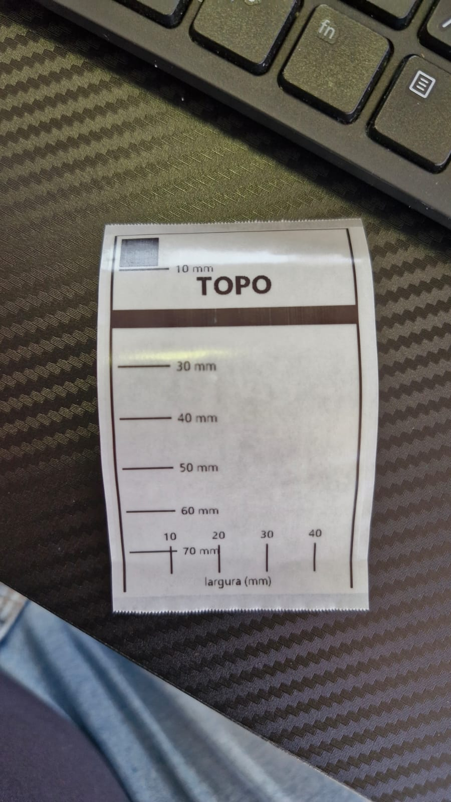
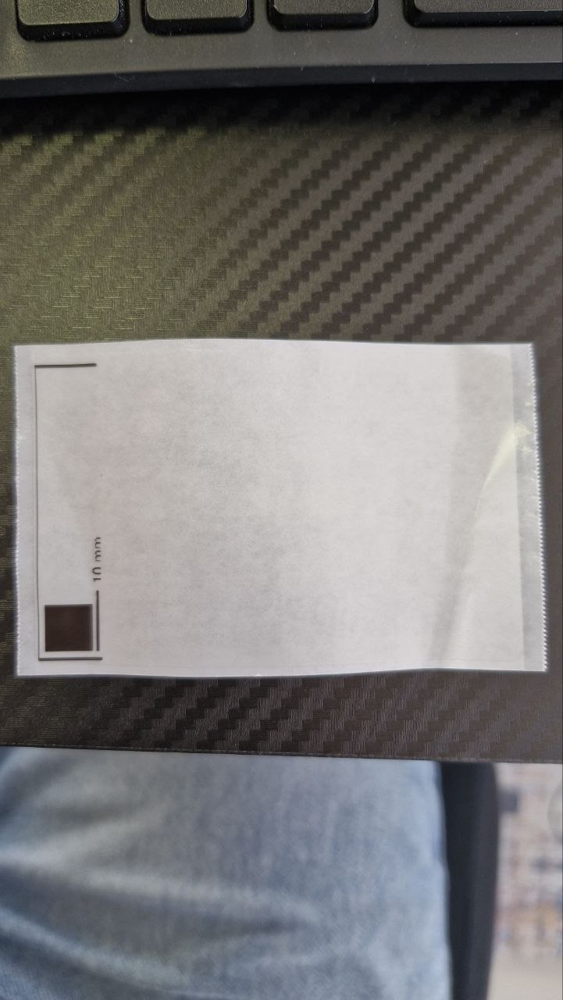

<div align="center">

# 🏷️ niimprint-b1

### 🖨️ Etiquetas de duas linhas na **Niimbot B1 via USB**, direto do Python — sem o app da Niimbot

🇧🇷 Português &nbsp;·&nbsp; 🇬🇧 [English](README.en.md)

<br>

[](https://printers.niim.blue/)
[](#-o-que-você-precisa)
[](#-o-que-você-precisa)
[](#-o-que-você-precisa)
[](LICENSE)

[](#-por-que-não-bluetooth-e-por-que-não-o-niimprintx)
[](https://github.com/AndBondStyle/niimprint)
[](#-layout-da-etiqueta)
[](#painel)
[](#-adoção-via-ai-skill-de-claude-code)

<br>


<sub>💡 Uma linha de destaque + uma linha de apoio · bloco centralizado nos dois eixos · corpo da fonte escolhido sozinho</sub>

</div>

---

## 🎯 O que é

Um **fork de [`AndBondStyle/niimprint`](https://github.com/AndBondStyle/niimprint)** focado num cenário único e específico:

> ### 🖨️ **Niimbot B1** &nbsp;•&nbsp; 🔌 **conectada por USB** &nbsp;•&nbsp; 🪟 **rodando no Windows**

Ele faz três coisas:

1. 🏷️ **Desenha e imprime uma etiqueta de duas linhas centralizadas** — a de cima em destaque, a de baixo menor. O corpo da fonte é escolhido automaticamente e o texto quebra em duas linhas se precisar, sem nunca invadir a margem que protege do corte.
2. 📋 **Enfileira as impressões** — quem opera devolve o controle na hora, e a B1 recebe um trabalho completo por vez, só começando o próximo quando a **impressora** confirma que o papel parou.
3. 🔧 **Conserta o driver** — o `niimprint` original não funciona na B1 por USB. As [4 correções](#-as-4-correções-que-fazem-a-b1-funcionar) que fazem funcionar são a parte que custou caro para descobrir.

**Você só precisa entender [como o dado entra](#-como-o-dado-entra).** O resto é o mesmo para qualquer conteúdo.

> 🌱 **De onde veio.** Nasceu de um balcão de check-in de evento: chega uma pessoa, o operador acha o nome, faz o check-in e comanda a impressão. Por isso os arquivos de exemplo são crachás. Mas nada aqui é específico de evento — a etiqueta são só duas linhas de texto, e quem decide o que entra em cada uma é você.

---

## ⚡ Começando em 3 comandos

```bash
py etiquetas.py info
```
🩺 Testa a conexão e mostra firmware/bateria. **Não gasta etiqueta.** Use sempre primeiro.

```bash
py etiquetas.py preview
```
🖼️ Gera os PNGs em `preview/` no sentido de leitura, sem imprimir.

```bash
py etiquetas.py print
```
🖨️ Imprime todos, um trabalho completo por etiqueta, numa única conexão serial.

<div align="center">

| 🏷️ | 🏷️ | 🏷️ |
|:---:|:---:|:---:|
|  |  |  |
| texto curto | texto longo, quebra em 2 linhas | acentuação |

<sub>Saída real de `py etiquetas.py preview` — 639 × 384 px, no sentido de leitura</sub>

</div>

---

## 📥 Como o dado entra

**Esta é a única parte que muda de um uso para outro.** A etiqueta tem sempre a mesma forma — linha de destaque em cima, linha de apoio embaixo. Você diz o que entra em cada uma com dois templates.

### O arquivo

Um `.json` (lista de objetos) **ou** um `.csv` com cabeçalho. As colunas são suas — todas ficam disponíveis para os templates.

```json
[
  {"Nome": "José Vitor Lopes", "Empresa": "Lopes Advogados", "Cargo": "Sócio"}
]
```

```csv
Patrimonio,Setor,Responsavel,Serie
PAT-004821,TI,Notebook Dell 5420,BR7X2K9
```

### Os templates

`--linha1` e `--linha2` recebem texto com `{Coluna}` no meio. A busca do nome da coluna **ignora maiúsculas** e aceita nome com espaço (`{Job Title}`).

```bash
# o default (crachá) — não precisa passar nada:
py etiquetas.py print --linha1 "{Nome}" --linha2 "{Empresa} - {Cargo}"

# patrimônio:
py etiquetas.py print --in exemplo_ativos.csv \
    --linha1 "{Patrimonio}" --linha2 "{Setor} - {Responsavel}"

# só uma linha, bem grande, centralizada na etiqueta inteira:
py etiquetas.py print --in mesas.csv --linha1 "{Mesa}" --linha2 ""
```

| Você tem | `--linha1` | `--linha2` |
|---|---|---|
| 🎟️ Crachá de evento | `{Nome}` | `{Empresa} - {Cargo}` |
| 📦 Patrimônio | `{Patrimonio}` | `{Setor} - {Responsavel}` |
| 🧪 Amostra de laboratório | `{Codigo}` | `{Paciente} · {Coleta}` |
| 🪑 Lugar marcado | `{Mesa}` | `` (vazio) |
| 📚 Acervo | `{Tombo}` | `{Titulo}` |

### Campo vazio não deixa buraco

Se um campo do template não existir ou vier em branco, o separador órfão some sozinho:

| Template | Registro | Sai |
|---|---|---|
| `{Empresa} - {Cargo}` | ambos preenchidos | `Lopes Advogados - Sócio` |
| `{Empresa} - {Cargo}` | cargo em branco | `Lopes Advogados` |
| `{Setor} - {Item} / {Serie}` | item em branco | `TI - BR7X2K9` |
| `{Nome} ({Cargo})` | cargo em branco | `Ana` |
| `Lote: {Lote}` | lote em branco | *(vazio — não imprime só a moldura)* |

Se a **linha 1** ficar vazia em algum registro, o programa para antes de gastar etiqueta e lista as colunas que o arquivo realmente tem.

### Apelidos prontos para export do lu.ma

Um CSV com cabeçalho em inglês funciona sem você renomear nada — estes apelidos viram `{Nome}` / `{Empresa}` / `{Cargo}` automaticamente:

| Campo canônico | Cabeçalhos reconhecidos |
|---|---|
| 👤 `{Nome}` | `Nome` · `Name` · `Full Name` |
| 🏢 `{Empresa}` | `Empresa` · `Company` · `Organization` |
| 💼 `{Cargo}` | `Cargo` · `Title` · `Job Title` · `Role` |

> 🧪 Os dados em `participantes.json`, `exemplo_luma.csv` e `exemplo_ativos.csv` são **fictícios** — servem para exercitar acentuação, nomes longos, quebra de linha e campo vazio. As fotos deste readme são de impressões reais feitas durante o desenvolvimento.

---

## 🧰 O que você precisa

| | Item | Valor |
|:---:|---|---|
| 🐍 | Python | **3.13** — no Windows use `py`, não `python` (o alias da Microsoft Store quebra o segundo) |
| 🖨️ | Impressora | **Niimbot B1** numa porta COM (`USB\VID_3513&PID_0002`) |
| 🔌 | Conexão | **USB** — aparece como porta serial (`COM3` por padrão aqui) |
| 📦 | Dependências | `pillow`, `pyserial` |
| 🔤 | Fontes | **Segoe UI** e **Segoe UI Bold**, que já vêm no Windows. Para trocar, edite `FONT_BOLD` / `FONT_REG` no topo de `etiquetas.py` com o caminho de qualquer `.ttf` |
| ⚙️ | Firmware testado | 13.06 / hardware 12.9 |
| 🏷️ | Rolo | 50 × 80 mm transparente (a B1 reporta tipo `5`) — [outro rolo?](#-adaptando-para-outro-rolo) |

```bash
py -m pip install pillow pyserial
```

> ⚠️ **Não use `requirements.txt` nem `poetry install`.** Esses dois arquivos são do
> upstream e pertencem ao `niimprint/`: eles fixam `pillow==10.1.0`, exigem `click` e
> travam `python = "~3.11"` — ou seja, **não instalam no 3.13**. Foi exatamente por
> isso que o driver foi vendorizado em `niimbot/`. A solução da B1 precisa só de
> `pillow` + `pyserial`, em qualquer versão recente.

---

## 🗺️ Arquitetura

```
niimprint-b1/
├── etiquetas.py           🏷️ CLI: info · preview · print. Desenha a etiqueta
│                             (render_label) e aplica os templates de linha
├── fila.py                📋 FilaImpressao — é por aqui que você liga o seu
│                             sistema. Uma thread, um trabalho por vez
├── painel.py              ⏱️ Página local em 127.0.0.1:8765 com cronômetro
│                             por etiqueta e troca de row_delay a quente
├── calibra.py             📐 Cartão de calibração com réguas em mm nos 2 eixos
├── diag.py                🩺 Diagnóstico da porta serial
│
├── niimbot/               🔧 O DRIVER CORRIGIDO — é este que roda
│   ├── printer.py            PrinterClient, SerialTransport, print_image,
│   │                         wait_until_done (as 4 correções vivem aqui)
│   └── packet.py             framing 55 55 <tipo> <len> <dados> <xor> aa aa
│
├── niimprint/             📚 O driver do upstream, INTOCADO, para diff
│
├── skill/SKILL.md         🤖 Skill de Claude Code (adoção via AI)
│
├── participantes.json     🧪 exemplo: crachá de evento (fictício)
├── exemplo_luma.csv       🧪 exemplo: export do lu.ma, cabeçalho em inglês
├── exemplo_ativos.csv     🧪 exemplo: patrimônio — nada a ver com evento
├── docs/                  🖼️ imagens deste readme
│
├── UPSTREAM-readme.md     📚 o readme original do upstream, preservado
├── requirements.txt       📚 do upstream, para o niimprint/ — NÃO use
├── pyproject.toml         📚 idem (trava python ~3.11)
├── poetry.lock            📚 idem
├── .pre-commit-config.yaml 📚 do upstream, não é usado aqui
└── examples/              📚 do upstream: PNGs de exemplo da B21.
                              Não são exemplos de código deste projeto
```

> 🧭 **Por que dois drivers?** `niimprint/` é o código do projeto-base, preservado exatamente como veio — é o que faz disto um *fork* de verdade e permite ver o diff. `niimbot/` é a cópia com as correções que fazem a B1 funcionar por USB, e é a que os scripts importam. As correções estão detalhadas [logo abaixo](#-as-4-correções-que-fazem-a-b1-funcionar).

---

## 🚩 Opções da CLI

| Flag | Default | Para quê |
|---|---|---|
| `--in arquivo` | `participantes.json` | 📄 Entrada `.json` ou `.csv` |
| `--linha1 "..."` | `{Nome}` | ✨ [Template](#-como-o-dado-entra) da linha de destaque |
| `--linha2 "..."` | `{Empresa} - {Cargo}` | ✨ Template da linha de apoio. `""` deixa só a linha 1 |
| `--port COM3` | `COM3` | 🔌 Porta serial da impressora |
| `--layout landscape\|portrait` | `landscape` | 🔄 `landscape` = texto no sentido dos 80 mm (etiqueta deitada) |
| `--density 1..5` | `5` | 🌡️ Densidade térmica. Baixe se borrar; suba se sair claro |
| `--copies N` | `1` | 🧾 Cópias por registro |
| `--only N` | — | 1️⃣ Usa só o N-ésimo registro |
| `--rotate180` | — | 🙃 Se sair de cabeça para baixo no porta-etiqueta |
| `--rowdelay 0.005` | `0.005` | ⏱️ **Ritmo de envio das linhas.** [Não mexa sem ler](#rowdelay) |

> 🚫 Não existe flag de pausa entre etiquetas. Ela foi **removida de propósito** — quem sabe quando a etiqueta acabou é a impressora, não um `sleep` chutado.

---

## 📦 Uso como biblioteca

### A fila (recomendado)

`imprimir()` devolve o controle na hora; uma única thread manda um trabalho por vez para a B1.

```python
from fila import FilaImpressao

fila = FilaImpressao(porta="COM3")          # abre a serial uma vez só

fila.imprimir("José Vitor Lopes", "Lopes Advogados - Sócio")
fila.imprimir("PAT-004821", "TI - Notebook Dell 5420")

fila.encerrar()                             # espera o que falta e fecha
```

| Membro | O que faz |
|---|---|
| `FilaImpressao(porta, layout, densidade, rotate180, row_delay, ao_comecar, ao_terminar)` | Abre a serial e sobe a thread. `row_delay` pode ser trocado a quente |
| `imprimir(linha1, linha2="", ref=None, **extras)` | Enfileira e devolve o dict do pedido **na hora** |
| `imprimir_cracha(nome, empresa, cargo, ref=None)` | Atalho: `linha2 = "Empresa - Cargo"` |
| `aguardando` | Quantos pedidos ainda não começaram a imprimir |
| `esperar()` | Bloqueia até a fila esvaziar |
| `encerrar()` | Espera o resto, para a thread e fecha a porta |

`ref` é um identificador opaco seu (o id do check-in, o código do item). Ele volta em `pedido["ref"]` nos callbacks, para você casar a etiqueta com o registro no seu sistema **sem depender do texto impresso**. Qualquer `**extras` também viaja no pedido.

```python
def baixa(pedido, resultado, erro):
    if erro is not None or not resultado["completa"]:
        return                              # ⚠️ reimprima: não saiu inteira
    marcar_impresso(pedido["ref"])

def comecou(pedido):
    mostrar_na_tela("imprimindo: " + pedido["linha1"])

fila = FilaImpressao(porta="COM3", ao_comecar=comecou, ao_terminar=baixa)
```

> ⚠️ **Sempre confira `resultado["completa"]`.** `False` = a etiqueta saiu truncada. A fila avisa no console, mas quem dá baixa é o seu código. Ignorar isso marca alguém como atendido sem etiqueta na mão.

Os dois callbacks rodam **na thread da fila**. Exceção dentro deles é engolida de propósito — um callback ruim não pode derrubar a impressão.

### Desenho e leitura de dados

```python
from etiquetas import render_label, render_cracha, to_print, load_registros, formatar
```

| Função | Devolve |
|---|---|
| `render_label(linha1, linha2="", layout="landscape")` | Imagem 1-bit **no sentido de leitura**. `linha2` vazia centra a linha 1 na etiqueta inteira |
| `render_cracha(nome, empresa, cargo, layout=...)` | Atalho de três campos sobre `render_label` |
| `to_print(img, layout, rotate180=False)` | Gira para o sentido do papel (largura tem de ser 384 px). **Obrigatório antes de imprimir** |
| `load_registros(caminho)` | Lista de dicts do `.json`/`.csv`, com todas as colunas + os apelidos canônicos |
| `formatar(template, registro)` | Aplica um `"{Campo} - {Outro}"` a um registro |

### O driver direto (sem fila — bloqueia até a etiqueta sair)

```python
from etiquetas import render_label, to_print
from niimbot import PrinterClient, SerialTransport, PrinterBusy

pr = PrinterClient(SerialTransport(port="COM3"))   # abra UMA vez

img = to_print(render_label("PAT-004821", "TI - Notebook Dell 5420"), "landscape")
r = pr.print_image(img, density=5, row_delay=0.005)
```

Mantenha o `PrinterClient` vivo enquanto o programa roda — reabrir a porta serial por etiqueta deixa lento e dá falha intermitente. `SerialTransport(port="auto")` procura a impressora sozinho.

**`print_image()` devolve um dicionário, e ele é a fonte da verdade:**

```python
{
  "completa":  True,        # ✅ o ÚNICO campo que você precisa checar sempre
  "linhas_ok": 638,         # última linha que a B1 confirmou ter processado
  "esperado":  638,         # última linha da imagem
  "status": {
      "page": 1,
      "progress1": 100,     # % recebido pela impressora
      "progress2": 100,     # % efetivamente IMPRESSO
      "ok":     True,       # a espera terminou por confirmação, não por timeout
      "zerou":  True,       # o contador zerou: o sinal de fim é confiável
  },
  "tempos": {
      "papel":  0.35,       # do início do trabalho até a primeira linha sair
      "envio":  3.71,       # as 639 linhas, no ritmo do row_delay
      "espera": 1.92,       # do fim do envio até a impressora confirmar
      "total":  6.00,
  },
}
```

Passando pela fila, `tempos` ganha mais dois campos (`render` e `fila`, o tempo parado na fila) e o dicionário ganha `row_delay`.

- `completa=False` **com `status["ok"]=True`** → a B1 descartou linhas: [suba o `row_delay`](#rowdelay).
- `status["zerou"]=False` → o contador de progresso não zerou, a espera caiu para tempo fixo e o sinal de fim não é confiável.
- `PrinterBusy` (exceção) → a impressora **recusou** o comando. Não adianta repetir; [veja o que fazer](#-problemas-comuns).

---

## 🤖 Adoção via AI (skill de Claude Code)

O repositório traz uma **skill** em [`skill/SKILL.md`](skill/SKILL.md): com ela instalada, você pede em português — *"imprime uma etiqueta pro João da Acme, gerente"* — e o agente cuida do resto, seguindo as regras que evitam desperdiçar etiqueta e tempo.

```bash
# escopo do projeto (só neste repo):
mkdir -p .claude/skills/niimprint-b1 && cp skill/SKILL.md .claude/skills/niimprint-b1/

# ou escopo global (todos os projetos):
mkdir -p ~/.claude/skills/niimprint-b1 && cp skill/SKILL.md ~/.claude/skills/niimprint-b1/
```

A skill ensina o agente a testar a conexão antes de imprimir, a nunca chutar a porta COM, a conferir `completa` antes de dar qualquer coisa por impressa e a reconhecer `PrinterBusy` como "desligue e ligue", não como "tente de novo".

---

## 🩹 As 4 correções que fazem a B1 funcionar

Esta é a parte que custou caro para descobrir e que sustenta todo o resto. Cada item é uma diferença real entre `niimprint/` (upstream) e `niimbot/` (o que roda aqui).

### 1️⃣ `end_print()` não espera nada

Na B1 ele responde `True` na primeira tentativa, com a etiqueta **ainda saindo da cabeça**. O `while not end_print()` do driver original é decorativo. Confiar nele faz uma etiqueta atropelar a outra.

<div align="center">


<sub>👉 O corte caiu no meio do nome: o <b>P</b> de “Patrícia” ficou na etiqueta da Luiza e a dela começa em “trícia”. O driver achou que a primeira tinha acabado e já mandou a segunda — <b>com o papel ainda andando</b>.</sub>

</div>

É exatamente por isso que `wait_until_done()` existe: quem sabe onde o papel parou é a impressora, que enxerga o gap com o sensor dela. Depois da correção, três impressões seguidas saem alinhadas, sem traço e sem corte fora de lugar.

### 2️⃣ `get_print_status()` estava quebrado — e tem uma armadilha

A B1 devolve **10 bytes**; o upstream desempacotava 4 (formato da B21) e estourava `unpack requires a buffer of 4 bytes`. Corrigido fatiando `packet.data[:4]`. Ele devolve:

- 📥 `progress1` — quanto a impressora **recebeu**
- 🖨️ `progress2` — quanto ela **imprimiu** ← *o sinal de fim de verdade*

**🪤 A armadilha do contador velho.** Parada, a B1 responde `100/100` — o resultado do trabalho **anterior**. Ela não zera no `start_print`, e sim no `end_page_print`:

```
após start_print       p1=100 p2=100   ← ainda o trabalho ANTERIOR
após última linha      p1=100 p2=100   ← ainda
após end_page_print    p1=  0 p2=  0   ← zera só aqui
+0,75 s                p1=100 p2=100   ← terminou de verdade ✅
```

Por isso `wait_until_done()` **só aceita `100/100` depois de ter visto o contador zerar**. Aceitar o primeiro `100/100` daria "terminei" instantâneo com a etiqueta ainda na cabeça — e pior, reportando `completa=True`. **Falha silenciosa é o pior modo de falhar aqui.**

### 3️⃣ O `read()` que custava meio segundo por comando

O upstream lia a resposta com `read(1024)` numa serial com `timeout=0.5`. O pyserial só devolve quando junta os 1024 bytes **ou** quando o timeout estoura — e a B1 responde com ~8 bytes. Resultado: **todo comando custava 0,5 s cravados**. São 7 comandos antes da primeira linha = 3,5 s de papel parado.

| | por comando | etiqueta inteira |
|---|---|---|
| ❌ antes | 0,50 s | 19,03 s |
| ✅ depois | **0,05 s** | **13,97 s** |

### 4️⃣ O `_recv()` que girava para sempre

Com respostas parciais passando a ser comuns, apareceu um laço infinito que estava no upstream desde sempre: se o buffer tinha um pacote pela metade, o `while` não saía nunca (não havia `break`) e o processo travava em **100% de CPU**. Corrigido com um `break` quando o pacote ainda está incompleto.

---

<a id="rowdelay"></a>

## ⏱️ O ritmo de envio (`--rowdelay`)

> 🔥 **A B1 descarta silenciosamente as linhas que chegam mais rápido do que ela imprime.** Não devolve erro: todos os comandos respondem `True`. O sintoma é a etiqueta sair com o começo do desenho correto e o resto em branco.

<div align="center">


<sub>😱 O sintoma: mandando as 639 linhas em rajada, a B1 imprimia só os primeiros ~10 mm dos 80 mm</sub>
</div>

Durante o envio a impressora emite pacotes de progresso do tipo `0xD3` a cada 200 linhas, com o número da linha processada:

```
5555 d3 03 00c7 01 16 aaaa   →  0x00C7 = linha 199
5555 d3 03 027e 01 ad aaaa   →  0x027E = linha 638
```

`print_image()` lê esses pacotes e compara a última linha confirmada com a última linha da imagem — é isso que preenche `completa` no retorno. Um `--rowdelay` baixo demais agora aparece como **`FALHOU`**, não como etiqueta torta silenciosa. 🎉

### 📊 Medição real nesta máquina

Com etiqueta de verdade, sem nenhuma linha perdida em nenhum dos três:

| `row_delay` | 📤 envio | ⏳ espera | 🏁 **pronta** | |
|---|---|---|---|---|
| `0,020` | 13,38 s | 0,26 s | **13,97 s** | 🐢 folga total |
| `0,005` | 3,71 s | 1,92 s | **6,00 s** | ✅ **default** |
| `0,002` | 1,76 s | 2,34 s | **4,48 s** | ⚠️ folga no limite |

Repare no que a coluna **espera** faz enquanto o envio encolhe: **ela cresce.** Não é ruído — é a folga sendo gasta.

- 🐢 A `0,020` as linhas chegam mais devagar do que a B1 imprime: quando a última entra, não há nada pendente (espera 0,26 s).
- ⚠️ A `0,002` as linhas chegam **mais rápido** do que ela imprime, e o que segura a diferença é o buffer interno dela — ao fim do envio ainda restam 2,3 s de fila para revelar.

Enquanto o buffer aguenta, sai perfeito. Quando não aguentar, ele **descarta calado**.

> 🎯 **Por isso o default é `0,005` e não `0,002`.** Os 1,5 s a mais de velocidade custam a folga inteira, e a falha não avisa — sai uma etiqueta truncada, com o texto pela metade, na hora errada.

---

<a id="painel"></a>

## ⏲️ O painel de tempo (`painel.py`)

```bash
py painel.py
py painel.py --in exemplo_ativos.csv --linha1 "{Patrimonio}" --linha2 "{Setor}"
```

🌐 Página local em **http://127.0.0.1:8765** — *só localhost, por decisão: isto comanda uma impressora física, não vai para a rede.*

Um botão por registro: o cronômetro dispara no clique e para quando a **impressora confirma** o fim daquela etiqueta. Ele existe porque de fora só dá para ver a etiqueta saindo, sem saber quando o procedimento começou.

| Coluna | O que é |
|---|---|
| 📋 **fila** | esperando a etiqueta anterior. Zero quando a fila está vazia |
| 🎨 **render** | desenhar a imagem em memória (~0,05 s) |
| 📜 **papel anda** | do clique até a primeira linha entrar no fio |
| 📤 **envio** | as 639 linhas, no ritmo do `row_delay` |
| ⏳ **espera** | do fim do envio até a impressora dizer que terminou |
| 🏁 **pronta** | **clique → etiqueta na mão.** É o número que importa |

> 💡 **Não confunda "começou" com "pronta".** A B1 imprime conforme as linhas chegam, então o papel anda quase de imediato — "começou a imprimir" é um número fácil e enganoso.

Os botões de `row_delay` trocam o ritmo **a quente**, valendo do próximo pedido em diante. É para isso que o painel serve de verdade: clicar em `0,020` / `0,010` / `0,005` / `0,002` com etiquetas de verdade e ver em qual valor a B1 começa a descartar linhas — a etiqueta aparece marcada **🔴 INCOMPLETA**, em vez de sair torta em silêncio.

---

## 📐 Layout da etiqueta

O rolo usado aqui é **50 × 80 mm transparente** (a impressora reporta tipo `5`):

| | medida |
|---|---|
| 🏷️ corpo da etiqueta | 50 × 80 mm |
| ✂️ gap entre etiquetas (onde é o corte) | **2,0 mm** → passo de 82 mm |
| 📏 largura do liner | 53 mm (1,5 mm livres de cada lado) |
| 🖨️ largura útil da cabeça | 384 px = **48,06 mm** — *não alcança a borda da etiqueta* |
| 🖼️ imagem enviada | **384 × 639 px** (48,06 × 80,0 mm) |

- **Duas linhas centralizadas** nos dois eixos: a de cima em negrito e maior, a de baixo em peso normal. Cada uma quebra em até duas linhas se precisar.
- **Margens** (`MARGEM_PAPEL_MM` / `MARGEM_CABECA_MM`): **6 mm** no eixo dos 80 mm e **4 mm** no eixo dos 50 mm. A do eixo do papel é a que importa — é nela que o texto encostaria no corte se a etiqueta parasse fora do lugar.
- **Fonte auto-ajustável:** encolhe e, se preciso, quebra em duas linhas. Se nem no tamanho mínimo couber, continua encolhendo em vez de estourar a margem — a margem é justamente o que protege do corte.
- Renderização com **supersampling 3×** e binarização por limiar, para traço limpo no térmico.

### 📏 Cartão de calibração

```bash
py calibra.py --print --delay=0.005
```

<div align="center">

&nbsp;&nbsp;


<sub>Réguas em mm nos dois eixos + marcador de orientação. Se a régua chegar aos 70 mm, o ritmo é seguro ✅</sub>
</div>

---

## 🔧 Adaptando para outro rolo

Tudo o que depende do tamanho da etiqueta está nas primeiras linhas de [`etiquetas.py`](etiquetas.py). Na prática **você muda uma constante só**:

```python
LABEL_MM = (50, 80)          # (largura do rolo, comprimento da etiqueta) em mm
```

| Constante | Mexe? | Por quê |
|---|:---:|---|
| `DPI = 203` | 🔒 **não** | É a resolução da cabeça térmica da B1 |
| `HEAD_PX = 384` | 🔒 **não** | É a largura física da cabeça da B1 (48,06 mm). Ela **não alcança** a borda de um rolo de 50 mm — e num rolo mais estreito que 48 mm sobra cabeça, não falta |
| `LABEL_MM = (50, 80)` | ✅ **sim** | O seu rolo. Ex.: `(40, 30)` |
| `FEED_PX` | ⚙️ derivado | Sai de `LABEL_MM[1]`, não edite |
| `MARGEM_PAPEL_MM = 6.0` | ✅ talvez | **A margem que protege do corte.** Numa etiqueta curta, 6 mm de cada ponta come metade do papel — desça para ~3 mm e calibre |
| `MARGEM_CABECA_MM = 4.0` | ✅ talvez | Menos crítica: a cabeça já não alcança a borda |
| `THRESHOLD = 150` | ✅ talvez | Suba para traço mais gordo, desça para mais fino |
| `SS = 3` | ⚙️ deixe | Supersampling do anti-serrilhado |

O **tipo de rolo** não é constante nenhuma: o driver pergunta à impressora qual rolo ela detectou (`LABELTYPE`) e usa a resposta. Forçar o tipo errado faz sair em branco.

Depois de trocar `LABEL_MM`, o roteiro é:

```bash
py etiquetas.py preview          # 1. confira as proporções no PNG
py calibra.py --print --delay=0.005   # 2. imprima a régua e meça com uma régua de verdade
py etiquetas.py print --only 1   # 3. uma etiqueta real
```

Se o texto encostar no corte, suba `MARGEM_PAPEL_MM`. Se sobrar papel em branco demais, desça.

> ⚠️ Se o rolo for **mais largo que 48 mm**, a cabeça não imprime até a borda — isso é limitação física da B1, não do código. Um rolo de 50 mm sempre terá ~1 mm sem impressão de cada lado.

---

## 🆘 Problemas comuns

<details>
<summary>🚫 <b><code>could not open port COM3</code> / acesso negado</b></summary>

O app da Niimbot (ou o driver dele) está segurando a porta. **Feche o app**, incluindo o ícone da bandeja.
</details>

<details>
<summary>🔍 <b>A porta não é COM3</b></summary>

A porta pode mudar de USB. Para descobrir:

```bash
py -c "from serial.tools.list_ports import comports; [print(p.device, p.description) for p in comports()]"
```

Ou use `SerialTransport(port="auto")`, que procura sozinho.
</details>

<details>
<summary>🕳️ <b><code>A linha 1 ficou vazia no(s) registro(s) ...</code></b></summary>

O template de `--linha1` não casou com nenhuma coluna do arquivo. A mensagem lista as colunas que o arquivo realmente tem — use uma delas. Veja [como o dado entra](#-como-o-dado-entra).
</details>

<details>
<summary>🌫️ <b>Sai claro ou borrado</b></summary>

Mexa em `--density` (5 é o máximo da B1). Etiqueta transparente costuma pedir densidade alta.
</details>

<details>
<summary>🙃 <b>Sai invertido no porta-etiqueta</b></summary>

Use `--rotate180`.
</details>

<details>
<summary>✂️ <b>Imprime o começo do desenho e o resto sai em branco</b></summary>

O `--rowdelay` está baixo demais: a B1 descartou linhas. **Suba o valor.** `0.02` é o ritmo com folga total (14 s por etiqueta) e serve para confirmar que o problema era o ritmo, não outra coisa.
</details>

<details>
<summary>⬜ <b>Etiqueta sai totalmente em branco</b></summary>

Tipo de rolo errado. O driver pergunta à impressora qual rolo ela detectou (`LABELTYPE`); neste rolo transparente ela responde `5`. Forçar o tipo `1` faz sair em branco.
</details>

<details>
<summary>🛑 <b><code>PrinterBusy: a impressora recusou o comando (0xDB codigo N)</code></b></summary>

A B1 está travada e não aceita `start_print`. Causas: tampa aberta, rolo acabado ou mal encaixado, ou um **trabalho anterior interrompido no meio** (matar o processo Python durante a impressão faz exatamente isso).

Feche a tampa, confira o rolo e, se persistir, **desligue e ligue a impressora** — é o que destrava. Repetir o comando não adianta.

⚠️ Consultas de leitura (`info`, `get_print_status`) continuam respondendo normalmente nesse estado, então *"a impressora responde"* não quer dizer que ela vai imprimir.
</details>

<details>
<summary>💥 <b>Uma etiqueta atropela a outra</b></summary>

Não deveria mais acontecer. Se acontecer, veja se `resultado["status"]["zerou"]` está `False`: significa que o contador de progresso não zerou e a espera caiu para tempo fixo.
</details>

---

## 📡 Por que não Bluetooth (e por que não o NiimPrintX)

| | |
|---|---|
| 🔵 **Bluetooth** | O driver tem `BluetoothTransport`, mas o socket RFCOMM do Python **não existe no Windows**. Na hora que importa, use USB. |
| 📦 **`labbots/NiimPrintX`** | É **exclusivamente Bluetooth** (usa `bleak`, não tem transporte serial) e ainda exige `pycairo` + ImageMagick. |
| 🤖 **Android** | O `pyserial` não acessa USB no Android (precisa da API USB Host do Java). O notebook com Windows é a rota confiável. |

A B1 ligada por USB aparece como **porta serial** — e o `niimprint` fala o mesmo protocolo Niimbot por serial. É o caminho certo para USB. O driver foi copiado para dentro do projeto porque o `pyproject.toml` do upstream trava `python = "~3.11"` e não instala no 3.13.

---

## 🔗 Projeto irmão: de onde o CSV pode vir

Se o seu dado está num evento no **Lu.ma**, o [**`josevitorls/luma-etiquetas`**](https://github.com/josevitorls/luma-etiquetas) lista os convidados e exporta exatamente o CSV que este projeto consome:

```
Lu.ma  ──▶  luma-etiquetas  ──▶  convidados.csv  ──▶  niimprint-b1  ──▶  🏷️ Niimbot B1
             (Node/TypeScript)      name,company,title      (Python/USB)
```

O cabeçalho em inglês do export é reconhecido sem renomear nada — veja [os apelidos](#-como-o-dado-entra). Os dois projetos são independentes: qualquer `.csv` ou `.json` serve aqui, venha ele de onde vier.

---

## 📖 Referência do protocolo

Framing: `0x55 0x55 <tipo> <len> <dados> <xor> 0xAA 0xAA`

📚 Documentação da comunidade: **https://printers.niim.blue/interfacing/proto/**

---

## 👥 Contribuidores

| | Quem | O quê |
|:---:|---|---|
| 👤 | **[José Vitor Lopes](https://github.com/josevitorls)** | Autor e mantenedor deste fork. Definiu o problema, forneceu o hardware, diagnosticou as falhas nas impressões reais e decidiu as escolhas de engenharia — inclusive o `row_delay` cauteloso e a fila unitária |
| 🤖 | **[Claude Opus 5](https://claude.com/claude-code)** (via Claude Code) | Coautor. Engenharia reversa do comportamento da B1, as 4 correções do driver, calibração, fila, painel de tempo e documentação |
| 🍴 | **[AndBondStyle](https://github.com/AndBondStyle)** | Autor do [`niimprint`](https://github.com/AndBondStyle/niimprint) que serviu de base a este fork |
| 🧬 | **[kjy00302](https://github.com/kjy00302)** | Autor do [`niimprint`](https://github.com/kjy00302/niimprint) original e da implementação do protocolo Niimbot |
| 📡 | **[niim.blue](https://printers.niim.blue/)** | Documentação comunitária do protocolo |

Achou um bug ou fez a coisa funcionar noutro rolo? [Abra uma issue](https://github.com/josevitorls/niimprint-b1/issues) contando qual rolo, qual firmware e qual `row_delay` — é exatamente o tipo de informação que falta na internet sobre a B1.

---

## 📄 Licença

**MIT** — veja [`LICENSE`](LICENSE).

O aviso de copyright original de `kjy00302` está preservado; o trabalho novo deste fork foi acrescentado como uma segunda linha, como manda a convenção MIT. O readme original do upstream está em [`UPSTREAM-readme.md`](UPSTREAM-readme.md).

<div align="center">
<br>

Feito com uma **Niimbot B1**, um cabo **USB** e um notebook **Windows**. 🏷️🔌🪟

</div>
